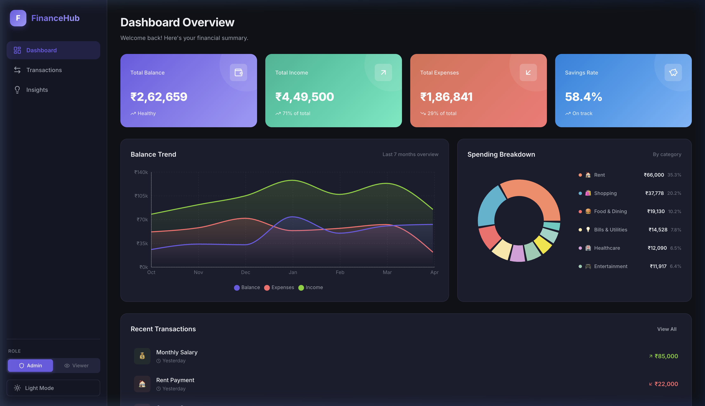

# FinanceHub - Personal Finance Dashboard

A modern, interactive finance dashboard built with **React.js** for tracking income, expenses, and spending patterns. Features a premium UI with dark/light themes, role-based access control, interactive charts, and comprehensive transaction management.



## 🚀 Live Demo

[View Live Demo](https://shannuthota.github.io/finance-dashboard/) <!-- Deployed on GitHub Pages -->

## ✨ Features

### Core Features
- **📊 Dashboard Overview** — Summary cards showing Total Balance, Income, Expenses, and Savings Rate with gradient designs and micro-animations
- **📈 Time-Based Visualization** — Interactive area chart displaying Balance, Income, and Expense trends over 7 months (Recharts)
- **🍩 Categorical Visualization** — Donut chart breaking down expenses by category with percentage labels
- **💳 Transaction Management** — Full CRUD operations with 60+ mock transactions displaying Date, Amount, Category, and Type
- **🔍 Search & Filtering** — Real-time search across transactions with filters for type (income/expense), category, and sort order
- **👤 Role-Based UI** — Toggle between Admin and Viewer roles:
  - **Admin**: Can add, edit, and delete transactions
  - **Viewer**: Read-only access, action buttons hidden
- **💡 Insights Section** — Key financial metrics including highest/lowest spending categories, savings rate, monthly expense change, average transaction value, and income stream count
- **📊 Monthly Comparison** — Side-by-side bar chart comparing income vs expenses across months
- **📋 Category Ranking** — Visual ranking of spending categories with animated progress bars

### Optional Enhancements (Implemented)
- **🌙 Dark/Light Mode** — Premium dark theme by default with smooth light mode toggle
- **💾 Data Persistence** — State saved to localStorage (transactions, theme, role preferences)
- **📤 Export Functionality** — Export filtered transactions as CSV or JSON files
- **✨ Animations & Transitions** — Fade-in animations, hover effects, smooth transitions throughout
- **📱 Responsive Design** — Fully adaptive layout for desktop, tablet, and mobile devices
- **🚫 Empty State Handling** — Graceful UI for no-data and filtered-empty scenarios

## 🛠️ Tech Stack

| Technology | Purpose |
|---|---|
| **React.js 19** | UI framework with functional components & hooks |
| **Vite** | Build tool & dev server |
| **Recharts** | Interactive charts (Area, Pie, Bar) |
| **Lucide React** | Premium icon library |
| **CSS Custom Properties** | Design system with theme variables |
| **Context + useReducer** | Centralized state management |
| **localStorage** | Data persistence |

## 📁 Project Structure

```
src/
├── components/
│   ├── Sidebar.jsx          # Navigation, role toggle, theme switch
│   ├── SummaryCards.jsx      # Dashboard overview cards
│   ├── BalanceTrend.jsx      # Area chart - balance over time
│   ├── SpendingBreakdown.jsx # Donut chart - category breakdown
│   ├── RecentTransactions.jsx # Recent transactions widget
│   ├── TransactionList.jsx   # Full transaction list with filters
│   ├── TransactionModal.jsx  # Add/Edit transaction modal
│   └── InsightsPanel.jsx     # Financial insights & analytics
├── context/
│   └── AppContext.jsx        # Global state (Context + useReducer)
├── data/
│   └── mockData.js           # Mock transactions & categories
├── utils/
│   └── helpers.js            # Formatting, calculations, exports
├── App.jsx                   # Main app with page routing
├── App.css                   # Complete design system & styles
├── index.css                 # Global reset
└── main.jsx                  # Entry point
```

## 🚀 Getting Started

### Prerequisites
- **Node.js** v18 or higher
- **npm** v9 or higher

### Installation

```bash
# Clone the repository
git clone https://github.com/SHANNUTHOTA/finance-dashboard.git
cd finance-dashboard

# Install dependencies
npm install

# Start development server
npm run dev
```

The app will be available at `http://localhost:5173/`

### Build for Production

```bash
npm run build
npm run preview
```

## 🏗️ Architecture & Design Decisions

### State Management
- Used **React Context + useReducer** for centralized state management — chosen over Redux for its simplicity and built-in React integration without additional dependencies
- State includes: transactions, filters, active role, dark mode, modal state
- All state changes go through a single reducer for predictability and easy debugging
- **localStorage** persistence ensures state survives page refreshes

### Component Design
- Each component is **self-contained** and responsible for rendering its own section
- Components consume state via the custom `useApp()` hook
- **Separation of concerns**: Data logic lives in `utils/helpers.js`, mock data in `data/mockData.js`

### Styling Approach
- **CSS Custom Properties** enable the dark/light theme system with a single `data-theme` attribute toggle
- **BEM-like naming** convention for maintainable CSS selectors
- No CSS framework dependency — full control over the design system
- Responsive breakpoints at 1200px, 992px, 768px, and 480px

### Role-Based UI
- Frontend-only RBAC simulation using a state-driven approach
- Admin role displays add/edit/delete controls; Viewer role hides them entirely
- Role preference is persisted to localStorage

### Charts & Visualization
- **Recharts** library chosen for its React-native approach and smooth animations
- Custom tooltips for brand-consistent styling
- Gradient fills for visual depth in area charts

## 📱 Responsive Breakpoints

| Breakpoint | Layout Changes |
|---|---|
| **> 1200px** | Full sidebar, 4-column summary cards, 2-column charts |
| **992px - 1200px** | 2-column summary cards, 2-column insights |
| **768px - 992px** | Collapsible sidebar, single-column charts |
| **< 768px** | Hamburger menu, stacked layout, touch-friendly controls |
| **< 480px** | Single-column everything, compact spacing |

## 🎨 Design System

### Color Palette
- **Primary**: `#6C5CE7` (Purple) — Accent, buttons, active states
- **Success**: `#7ED321` (Green) — Income indicators
- **Danger**: `#FF6B6B` (Red) — Expense indicators
- **Info**: `#45B7D1` (Blue) — Informational elements

### Typography
- **Font**: Inter (Google Fonts) — Modern, highly legible
- **Weights**: 300-800 for clear hierarchy

## 📝 Technical Trade-offs

1. **Mock Data vs API**: Used static mock data to focus on UI/UX quality rather than backend integration. The architecture supports easy API integration by replacing the data source in `mockData.js`.

2. **Context vs Redux**: Chose Context + useReducer for simplicity. For a larger app with deeper component trees, Redux or Zustand would be more performant.

3. **CSS vs Tailwind**: Used vanilla CSS with custom properties for full design control and to demonstrate CSS proficiency. Trade-off is slightly more boilerplate but zero framework dependency.

4. **Client-side routing**: Used simple state-based tab switching instead of React Router to keep the bundle size minimal for a single-page dashboard app.

5. **localStorage vs IndexedDB**: Used localStorage for its simplicity. For larger datasets, IndexedDB would be more appropriate.

## 👤 Author

**Shanmukha Sai Thota**  
Email: shannuthota2005@gmail.com

## 📄 License

This project is built as part of the Zorvyn FinTech internship assessment.
